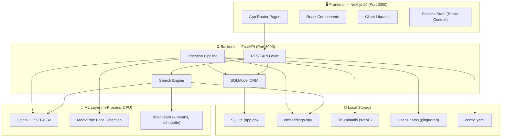
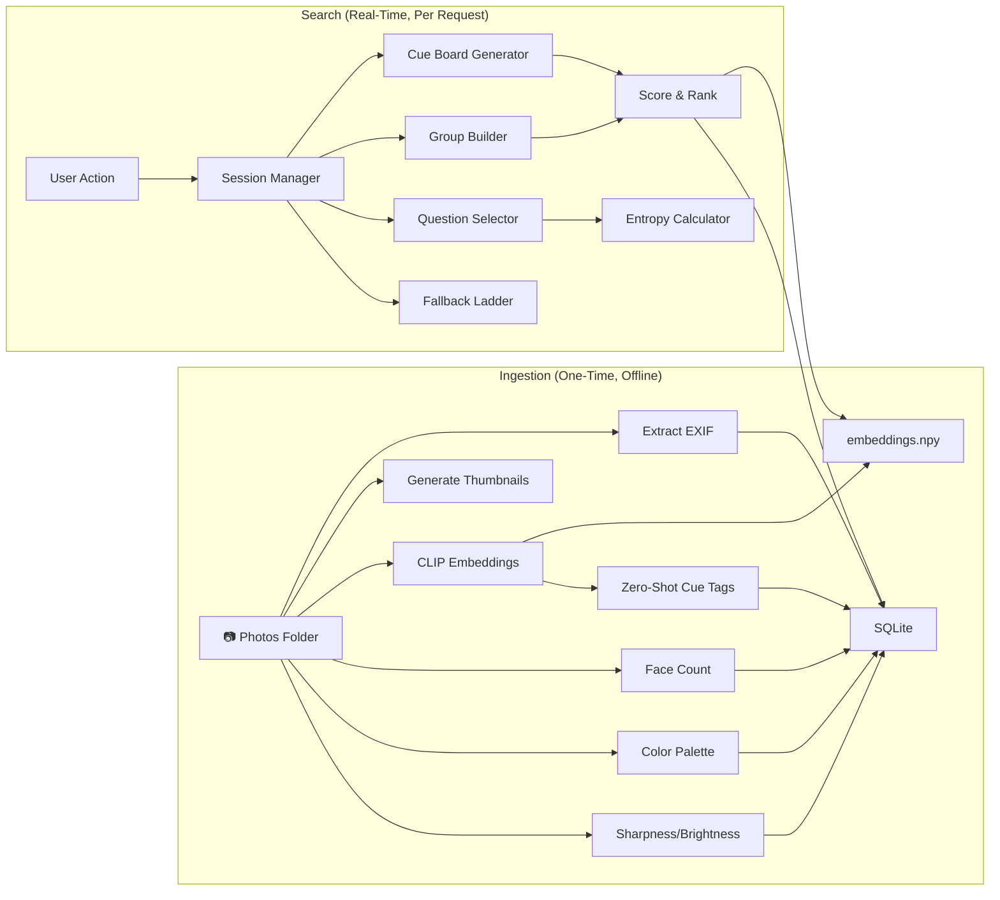
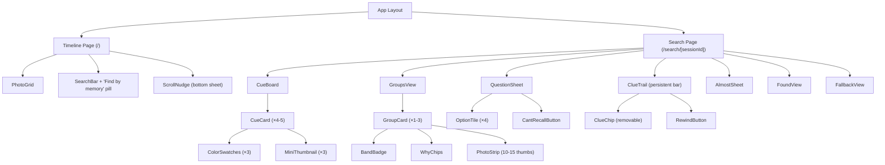
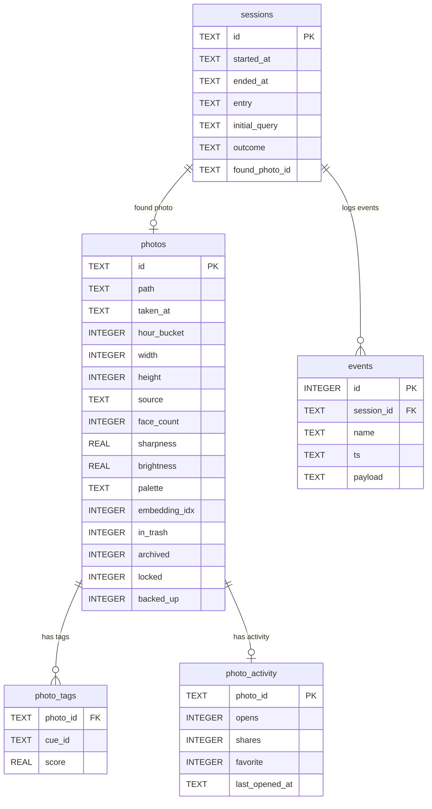
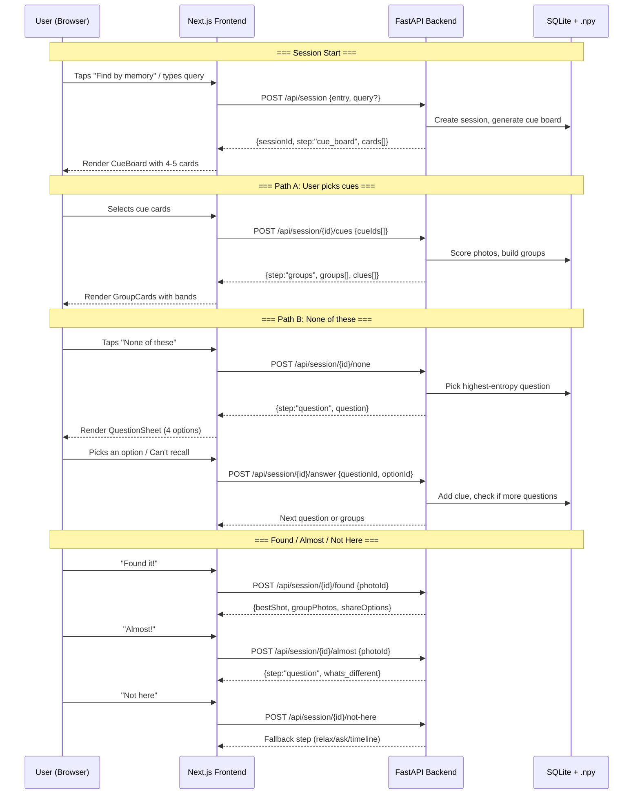
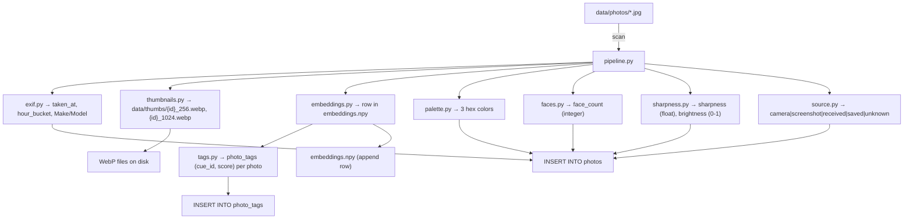
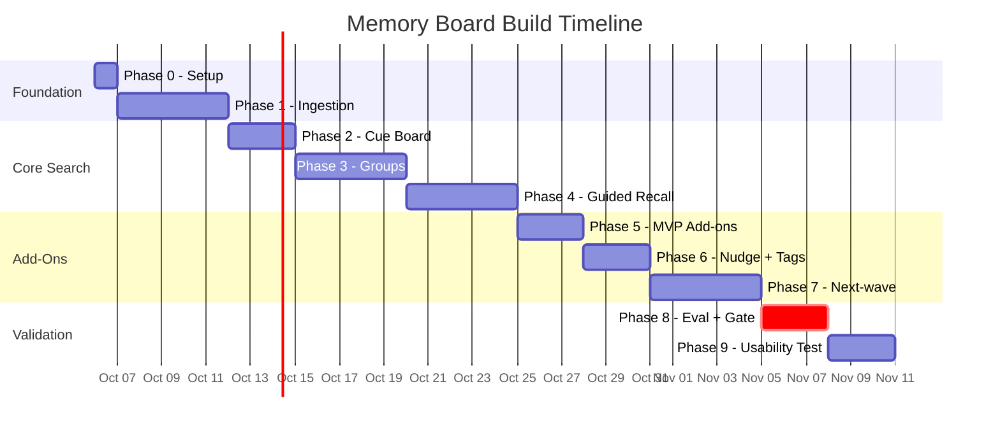

# Memory Board — Detailed Architecture & Phase-Wise Build Plan

---

## 1. System Architecture Overview

### 1.1 High-Level Architecture



### 1.2 Data Flow Architecture



### 1.3 Frontend Component Tree



---

## 2. Technology Stack (All Free Tier)

| Layer | Technology | Version | Purpose | Cost |
|-------|-----------|---------|---------|------|
| **Frontend** | Next.js (App Router) | 14.x | SSR + routing | $0 |
| | TypeScript | 5.x | Type safety | $0 |
| | Tailwind CSS | 3.x | Styling | $0 |
| **Backend** | Python | 3.11 | Runtime | $0 |
| | FastAPI | 0.104+ | REST API | $0 |
| | Uvicorn | latest | ASGI server | $0 |
| | SQLModel | latest | ORM (SQLite) | $0 |
| **ML** | open_clip_torch | latest | CLIP ViT-B-32 embeddings | $0 |
| | MediaPipe | latest | Face detection (count only) | $0 |
| | scikit-learn | latest | k-means, silhouette, isotonic regression | $0 |
| | numpy | latest | Embedding math | $0 |
| | opencv-python-headless | latest | Image processing | $0 |
| | Pillow | latest | Thumbnails, palette | $0 |
| **Storage** | SQLite | built-in | Relational data | $0 |
| | .npy files | — | Embedding vectors | $0 |
| | WebP on disk | — | Thumbnails | $0 |
| **Testing** | pytest | latest | Backend tests | $0 |
| | vitest | latest | Frontend tests | $0 |
| | Playwright | latest | E2E / smoke tests | $0 |
| **Tooling** | Make | built-in | Task runner | $0 |
| | Git + GitHub | free tier | Version control | $0 |

---

## 3. Database Schema (Complete)



---

## 4. API Contract (All Endpoints)



---

## 5. Complete File Map

```
memory-board/
├── implementation_plan.md
├── architecture_plan.md
├── Makefile                              # P0
├── README.md                             # P0
├── .gitignore                            # P0
│
├── config/
│   └── config.yaml                       # P0 — ALL constants (Appendix D)
│
├── data/                                 # ALL GITIGNORED
│   ├── photos/                           # User-supplied images
│   ├── thumbs/                           # Generated thumbnails (256px + 1024px WebP)
│   ├── embeddings.npy                    # CLIP embedding matrix
│   └── app.db                            # SQLite database
│
├── api/                                  # Python backend
│   ├── requirements.txt                  # P0
│   ├── app/
│   │   ├── __init__.py
│   │   ├── main.py                       # P0 — FastAPI app + CORS + static files
│   │   ├── config.py                     # P0 — Load config.yaml, fail if hardcoded
│   │   ├── database.py                   # P0 — SQLite engine + session factory
│   │   ├── models.py                     # P0 — SQLModel tables (5 tables)
│   │   ├── vocab.py                      # P1 — ~40 cues in 5 groups
│   │   │
│   │   ├── ingest/                       # P1 — Ingestion pipeline
│   │   │   ├── __init__.py
│   │   │   ├── pipeline.py               # P1 — Orchestrator (idempotent)
│   │   │   ├── exif.py                   # P1 — EXIF extraction + hour_bucket
│   │   │   ├── thumbnails.py             # P1 — 256px + 1024px WebP generation
│   │   │   ├── embeddings.py             # P1 — CLIP embedding computation
│   │   │   ├── palette.py                # P1 — 3-colour k-means palette
│   │   │   ├── faces.py                  # P1 — MediaPipe face count
│   │   │   ├── sharpness.py              # P1 — Laplacian variance + brightness
│   │   │   ├── tags.py                   # P1 — Zero-shot cue scoring
│   │   │   └── source.py                 # P1 — Source inference rules
│   │   │
│   │   ├── engine/                       # P2-P5 — Core search logic
│   │   │   ├── __init__.py
│   │   │   ├── session.py                # P2 — Session state machine + clue list
│   │   │   ├── cue_board.py              # P2 — Cue card generation (MMR)
│   │   │   ├── groups.py                 # P3 — Group builder (score + k-means)
│   │   │   ├── confidence.py             # P3 — Confidence formula + bands
│   │   │   ├── questions.py              # P4 — Information-gain question picker
│   │   │   ├── fallback.py               # P4 — No-dead-end ladder
│   │   │   └── almost.py                 # P5 — "Almost!" nearest-neighbour logic
│   │   │
│   │   └── routes/                       # P2-P5 — API route handlers
│   │       ├── __init__.py
│   │       ├── ingest.py                 # P1 — POST /api/ingest/run
│   │       ├── photos.py                 # P2 — GET /api/photos
│   │       ├── session.py                # P2 — All /api/session/* endpoints
│   │       ├── activity.py               # P6 — POST /api/activity
│   │       └── events.py                 # P8 — POST /api/events
│   │
│   └── tests/                            # Tests per phase
│       ├── conftest.py                   # P0 — Fixtures (test DB, sample photos)
│       ├── test_config.py                # P0 — No hardcoded constants
│       ├── test_ingest.py                # P1
│       ├── test_cue_board.py             # P2
│       ├── test_groups.py                # P3
│       ├── test_confidence.py            # P3 — Monotonicity, cant_recall no-op
│       ├── test_questions.py             # P4
│       ├── test_fallback.py              # P4
│       ├── test_almost.py                # P5
│       ├── test_nudge_rules.py           # P6
│       ├── test_no_network.py            # P1 — Fails if outbound call made
│       └── test_integration.py           # P4 — Full API flow tests
│
├── web/                                  # Next.js frontend
│   ├── package.json                      # P0
│   ├── tsconfig.json                     # P0
│   ├── tailwind.config.ts                # P0
│   ├── next.config.js                    # P0 — API proxy to :8000
│   │
│   ├── app/                              # App Router pages
│   │   ├── layout.tsx                    # P2 — Root layout, fonts, meta
│   │   ├── page.tsx                      # P2 — Timeline page
│   │   └── search/
│   │       └── [sessionId]/
│   │           └── page.tsx              # P2 — Search session page
│   │
│   ├── components/                       # React components
│   │   ├── Timeline.tsx                  # P2 — Photo grid, date headers
│   │   ├── SearchBar.tsx                 # P2 — Input + "Find by memory" pill
│   │   ├── CueBoard.tsx                  # P2 — 4-5 cue cards + None of these
│   │   ├── CueCard.tsx                   # P2 — Swatches + tag + 3 thumbs
│   │   ├── ClueTrail.tsx                 # P2 — Removable chips + Rewind
│   │   ├── GroupsView.tsx                # P3 — Up to 3 GroupCards
│   │   ├── GroupCard.tsx                 # P3 — Band, why, delta, photo strip
│   │   ├── BandBadge.tsx                 # P3 — Confidence band indicator
│   │   ├── QuestionSheet.tsx             # P4 — Bottom sheet, 4 tiles + Can't recall
│   │   ├── OptionTile.tsx                # P4 — Large tappable option
│   │   ├── AlmostSheet.tsx               # P5 — "What's different?" sheet
│   │   ├── FoundView.tsx                 # P5 — Best shot + share strip
│   │   ├── FallbackView.tsx              # P4 — Relaxed clues message
│   │   ├── ScrollNudge.tsx               # P6 — Bottom sheet nudge
│   │   ├── Skeleton.tsx                  # P2 — Loading skeleton
│   │   └── PhotoViewer.tsx               # P3 — Full-screen photo view
│   │
│   ├── lib/                              # Utilities
│   │   ├── api.ts                        # P2 — API client (fetch wrapper)
│   │   ├── types.ts                      # P2 — Clue, Group, Band, Session types
│   │   ├── useScrollNudge.ts             # P6 — Scroll detection hook
│   │   ├── telemetry.ts                  # P8 — Event batching + send
│   │   └── i18n.ts                       # P7 — Locale loader
│   │
│   └── locales/
│       ├── en.json                       # P2 — English strings
│       └── hi-Latn.json                  # P7 — Hinglish strings
│
└── eval/                                 # Evaluation
    ├── simulate.py                       # P8 — Simulated user harness
    ├── metrics.py                        # P8 — Compute success metrics
    ├── baselines.py                      # P8 — B1 (scroll) + B2 (text query)
    ├── calibrate.py                      # P8 — Isotonic regression for confidence
    └── reports/                          # P8 — Generated reports
        └── .gitkeep
```

---

## 6. Phase-Wise Build Plan

---

### Phase 0: Project Setup
**Estimated time: 4-6 hours**

> [!NOTE]
> Foundation phase. Nothing works without this. Every future phase depends on it.

#### What to build

| # | File | What to do |
|---|------|------------|
| 1 | `Makefile` | Targets: `setup`, `ingest`, `dev`, `test`, `eval`, `wipe` |
| 2 | `config/config.yaml` | All constants from Appendix D — copy exactly |
| 3 | `api/requirements.txt` | Pin all Python dependencies |
| 4 | `api/app/__init__.py` | Empty |
| 5 | `api/app/config.py` | Load YAML → dataclass; fail if any constant is accessed raw |
| 6 | `api/app/database.py` | SQLite engine, `create_all()`, session factory |
| 7 | `api/app/models.py` | 5 SQLModel tables matching Section 5 schema |
| 8 | `api/app/main.py` | FastAPI app skeleton, CORS, health check `/api/health` |
| 9 | `web/` scaffold | `npx create-next-app` with TypeScript + Tailwind + App Router |
| 10 | `web/next.config.js` | Proxy `/api/*` → `http://localhost:8000` |
| 11 | `.gitignore` | Ignore `data/`, `node_modules/`, `.venv/`, `__pycache__/` |
| 12 | `api/tests/conftest.py` | Test fixtures: in-memory DB, temp photo dir |
| 13 | `api/tests/test_config.py` | Grep for hardcoded numbers → fail |
| 14 | `README.md` | Setup instructions |

#### Acceptance criteria
- [ ] `make setup` → creates venv, installs deps, creates DB, installs frontend
- [ ] `make test` → pytest + vitest both green (1 trivial test each)
- [ ] `make dev` → starts both servers (API on :8000, web on :3000)
- [ ] No constant is hardcoded in any `.py` or `.ts` file (test enforces this)

#### Dependencies
None — this is the root phase.

---

### Phase 1: Ingestion & Photo Understanding
**Estimated time: 3-5 days**

> [!IMPORTANT]
> This is the **heaviest ML phase**. The CLIP model download (~300MB) happens here. After this, all photos are indexed and searchable.

#### What to build

| # | File | What to do |
|---|------|------------|
| 1 | `api/app/vocab.py` | ~40 cues in 5 groups with text prompts (Appendix A) |
| 2 | `api/app/ingest/pipeline.py` | Orchestrator: scan folder → process each photo → idempotent |
| 3 | `api/app/ingest/exif.py` | Read `DateTimeOriginal`, `Make/Model`; compute `hour_bucket` (EXIF or brightness fallback) |
| 4 | `api/app/ingest/thumbnails.py` | Generate 256px + 1024px WebP thumbnails to `data/thumbs/` |
| 5 | `api/app/ingest/embeddings.py` | Load CLIP ViT-B-32 → compute L2-normalised embeddings → append to `embeddings.npy` |
| 6 | `api/app/ingest/palette.py` | Downsample to 64×64 → k-means (k=3) → 3 hex colours |
| 7 | `api/app/ingest/faces.py` | MediaPipe face detection → store count only |
| 8 | `api/app/ingest/sharpness.py` | Laplacian variance (sharpness) + mean brightness (0-1) |
| 9 | `api/app/ingest/tags.py` | Zero-shot CLIP scoring per cue group → write `photo_tags` |
| 10 | `api/app/ingest/source.py` | Filename/EXIF pattern matching → source inference |
| 11 | `api/app/routes/ingest.py` | `POST /api/ingest/run` endpoint (dev only) |
| 12 | `api/tests/test_ingest.py` | Test EXIF fallback, palette extraction, source rules |
| 13 | `api/tests/test_no_network.py` | Monkeypatch `socket.socket` → fail if outbound call |

#### Data flow in this phase



#### Acceptance criteria
- [ ] `make ingest` processes 500+ photos without errors
- [ ] Re-running `make ingest` only processes new photos (idempotent)
- [ ] Prints report: count, time/photo, failures
- [ ] No network calls during ingestion (test passes)
- [ ] Unit tests: EXIF fallback when no EXIF, palette produces 3 valid hex, source rules match spec
- [ ] Spot-check: 50 random photos have sensible cue tags (≥80% correct)

#### Dependencies
Phase 0 complete.

---

### Phase 2: Cue Board + Session Foundation
**Estimated time: 2-3 days**

> [!NOTE]
> This is the first **user-visible** phase. After this, someone can open the app, see their photos, and get cue cards.

#### What to build

| # | File | What to do |
|---|------|------------|
| 1 | `api/app/engine/session.py` | Session state machine: create, add clue, remove clue, rewind, get state |
| 2 | `api/app/engine/cue_board.py` | Candidate set → filter cues by support → MMR selection → 4-5 cards with swatches + thumbs |
| 3 | `api/app/routes/photos.py` | `GET /api/photos?cursor=` — paginated, date-sorted |
| 4 | `api/app/routes/session.py` | `POST /api/session`, `POST /api/session/{id}/cues`, `POST /api/session/{id}/clues/remove`, `POST /api/session/{id}/rewind` |
| 5 | `web/lib/types.ts` | TypeScript types: `Clue`, `Group`, `Band`, `Session`, `CueCard` |
| 6 | `web/lib/api.ts` | Fetch wrapper with error handling |
| 7 | `web/app/layout.tsx` | Root layout, Google Fonts (Inter), meta tags |
| 8 | `web/app/page.tsx` | Timeline page with photo grid + search bar |
| 9 | `web/app/search/[sessionId]/page.tsx` | Search session page (step-based rendering) |
| 10 | `web/components/Timeline.tsx` | Date-sorted photo grid |
| 11 | `web/components/SearchBar.tsx` | Text input + "Find by memory" pill button |
| 12 | `web/components/CueBoard.tsx` | 4-5 selectable CueCards + "None of these" + "Fill it in" tab |
| 13 | `web/components/CueCard.tsx` | 3 colour swatches + tag label + 3 thumbnails |
| 14 | `web/components/ClueTrail.tsx` | Horizontal chip bar, each chip removable, Rewind button |
| 15 | `web/components/Skeleton.tsx` | Loading skeleton placeholder |
| 16 | `web/locales/en.json` | English UI strings |
| 17 | `api/tests/test_cue_board.py` | ≥4 cards, diversity (Jaccard), no duplicate thumbs |

#### Key algorithm: MMR Card Selection

```
Input: candidate photos C, all cues, current clues
Output: 4-5 cue cards

1. For each cue c:
   S_c = {photos where tag(photo, c) ≥ τ_cue}
   Keep if 5% ≤ |S_c|/|C| ≤ 60%

2. selected = []
3. While |selected| < 5 and eligible cues remain:
   For each remaining cue c:
     coverage_gain = |S_c \ ∪S_selected|
     max_overlap = max Jaccard(S_c, S_s) for s in selected
     score = coverage_gain - λ × max_overlap
   Pick cue with highest score
   Constraint: at least 2 vocabulary groups in first 4 picks

4. For each selected cue c:
   card.label = cue text
   card.swatches = k-means(k=3) on palettes of S_c members
   card.thumbs = [medoid of S_c, 2 most-different from medoid]
```

#### Acceptance criteria
- [ ] Board renders in ≤1s p95
- [ ] Always ≥4 cards (or graceful fallback message if <4 eligible)
- [ ] No two cards share >50% of their support set (Jaccard)
- [ ] Thumbnails within a card are visibly different (embedding distance > threshold)
- [ ] Clue trail shows/removes chips correctly; Rewind pops last action
- [ ] Mobile layout correct at 390×844

#### Dependencies
Phase 1 complete (photos ingested, tags computed).

---

### Phase 3: Groups & Confidence
**Estimated time: 3-5 days**

> [!IMPORTANT]
> Core intellectual property of the product. The confidence formula is the key differentiator — it must be **honest**, **formula-based**, and **monotone** in user input.

#### What to build

| # | File | What to do |
|---|------|------------|
| 1 | `api/app/engine/groups.py` | Score all photos → top 60 → k-means (k=3..5, silhouette) → enforce 10-15 per group → label from top shared cues |
| 2 | `api/app/engine/confidence.py` | Formula: `0.55·match − 0.20·exclusion + 0.15·tight + 0.10·prior` × evidence → bands |
| 3 | `web/components/GroupsView.tsx` | Render up to 3 GroupCards, sorted by confidence |
| 4 | `web/components/GroupCard.tsx` | Label, BandBadge, WhyChips, confidenceDelta, PhotoStrip, action buttons |
| 5 | `web/components/BandBadge.tsx` | Color-coded band indicator (highest/good/possible/unsure) |
| 6 | `web/components/PhotoStrip.tsx` | Horizontal scrollable strip of 10-15 thumbnails |
| 7 | `web/components/PhotoViewer.tsx` | Full-screen photo view on tap |
| 8 | `api/tests/test_groups.py` | Group sizes always 10-15; groups sorted by confidence |
| 9 | `api/tests/test_confidence.py` | Monotonicity tests; Can't recall = no-op; 0 clues → unsure |

#### Key algorithm: Confidence

```
match(G)     = Σ(c∈P) w_c · frac(G,c) / Σ(c∈P) w_c
exclusion(G) = Σ(n∈N) w_n · frac(G,n) / Σ(n∈N) w_n
tight(G)     = clamp((mean_cosine_sim - 0.5) / 0.4, 0, 1)
prior(G)     = mean behaviour prior of group photos
evidence     = min(1, |P| / 3)

raw  = 0.55·match − 0.20·exclusion + 0.15·tight + 0.10·prior
conf = raw × (0.6 + 0.4·evidence)

Band mapping:
  ≥0.60 + rank 1 → "Highest chance"
  0.35–0.60      → "Good chance"
  0.15–0.35      → "Possible"
  <0.15          → "Not sure yet"
  
Tie rule: if two groups within 0.05 → both "Good chance"
```

#### Acceptance criteria
- [ ] Groups always have 10-15 photos (property test)
- [ ] Adding a matching clue → confidence increases (monotonicity)
- [ ] `"Can't recall"` → confidence unchanged (no-op test)
- [ ] Zero confirmed clues → forced `unsure` band
- [ ] `why` chips accurately reflect the group's top matching cues
- [ ] `confidenceDelta` correctly shows change from previous step

#### Dependencies
Phase 2 complete (session + cue board working).

---

### Phase 4: Guided Recall & Fallback
**Estimated time: 3-5 days**

> [!NOTE]
> This phase makes the system **never dead-end**. After this, no matter what the user does, they always have a next step.

#### What to build

| # | File | What to do |
|---|------|------------|
| 1 | `api/app/engine/questions.py` | Question bank (7 questions) → compute entropy per question → pick highest-gain eligible question → max 3 |
| 2 | `api/app/engine/fallback.py` | Ladder: relax least-certain clue → ask more → hiding places (P7) → timeline with clues |
| 3 | `api/app/routes/session.py` (update) | Add `POST /api/session/{id}/none`, `POST /api/session/{id}/answer`, `POST /api/session/{id}/not-here` |
| 4 | `web/components/QuestionSheet.tsx` | Bottom sheet: question text + 4 OptionTiles + Can't recall + progress bar |
| 5 | `web/components/OptionTile.tsx` | Large tappable tile (≥48px touch target) |
| 6 | `web/components/FallbackView.tsx` | Plain-language message of what was relaxed + filtered timeline |
| 7 | `api/tests/test_questions.py` | Entropy calculation, eligibility rules, max 3 enforcement |
| 8 | `api/tests/test_fallback.py` | Full ladder traversal never hits empty screen |
| 9 | `api/tests/test_integration.py` | Complete flows: cues→groups→found; none→question→groups; not-here→fallback |

#### Key algorithm: Question Selection (Information Gain)

```
For each question q with options [o1, o2, o3, o4]:
  For each option o_k:
    p_k = |{photos in R where attribute matches o_k}| / |R|
  
  H(q) = -Σ p_k · log2(p_k)    # max 2.0 bits for 4 options
  
  Eligible if:
    - At least 2 options have p_k ≥ 0.10
    - Not already asked in this session
    - Not implied by existing clues
    
  Ask the eligible question with highest H(q)
  Stop if H < 0.5 bits or 3 questions asked
```

#### Acceptance criteria
- [ ] Starting from "None of these" → always reaches groups or filtered timeline
- [ ] Max 3 questions enforced; never asks redundant/implied questions
- [ ] Can't recall = no penalty, just moves on
- [ ] Fallback clearly tells user what was relaxed
- [ ] No screen is ever empty or shows an error state
- [ ] Integration test: 5 different user paths all complete successfully

#### Dependencies
Phase 3 complete (groups + confidence working).

---

### Phase 5: MVP Add-Ons
**Estimated time: 2-3 days**

#### What to build

| # | File | What to do |
|---|------|------------|
| 1 | `api/app/engine/almost.py` | Find k=30 nearest neighbours → compare cue tags → ask "What's different?" (4 options) → add clue, re-run |
| 2 | `api/app/routes/session.py` (update) | Add `POST /api/session/{id}/almost`, `POST /api/session/{id}/sentence`, `POST /api/session/{id}/found` |
| 3 | `web/components/AlmostSheet.tsx` | "What's different?" bottom sheet (4 options + Can't say) |
| 4 | `web/components/FoundView.tsx` | Best shot (large) + group photo strip + Share/Post/Album buttons |
| 5 | `web/components/SentenceBuilder.tsx` | Fill-in-the-blank: time + place + people + setting with tappable blanks |
| 6 | `api/tests/test_almost.py` | Nearest neighbours found; "What's different" options make sense |

#### Best shot selection formula
```
best = argmax(0.6 · normalize(sharpness) + 0.4 · exposure_score)
exposure_score = 1 − |brightness − 0.5| × 2
```

#### Acceptance criteria
- [ ] "Almost!" returns visually similar photos with meaningful difference options
- [ ] "Found it!" stops the flow immediately (no further questions)
- [ ] Fill-the-sentence: skipped blanks add nothing; filled blanks become clues
- [ ] Share uses Web Share API with clipboard fallback
- [ ] Each add-on has API test + Playwright smoke test

#### Dependencies
Phase 4 complete.

---

### Phase 6: Scroll Nudge & Behaviour Tags
**Estimated time: 2-3 days**

#### What to build

| # | File | What to do |
|---|------|------------|
| 1 | `web/lib/useScrollNudge.ts` | Scroll detection hook with all rules from Section 6.13 |
| 2 | `web/components/ScrollNudge.tsx` | Bottom sheet: message + "Find by memory" / "Not now" |
| 3 | `api/app/routes/activity.py` | `POST /api/activity {photoId, kind}` → update `photo_activity` |
| 4 | `api/app/engine/confidence.py` (update) | Add behaviour `prior` as tie-breaker (weight ≤ 0.10) |
| 5 | `api/tests/test_nudge_rules.py` | Trigger conditions, cooldowns, 3-dismissals-in-14-days |

#### Nudge trigger logic
```
Triggers when ALL are true:
  1. Continuous scrolling ≥ 10s (gaps < 800ms)
  2. At least ONE hunting signal:
     - ≥3 direction reversals
     - Scrolled past ≥3 months of photos
     - ≥40 rows

Does NOT trigger when:
  - Photo viewer is open
  - Within 60s after "Found"
  - Already shown this session (max 1)
  - 3 dismissals in last 14 days → suppressed 30 days
  - Settings toggle "Search nudges" is off
```

#### Acceptance criteria
- [ ] Nudge fires correctly after hunting behaviour (unit test)
- [ ] Max 1 per session; respects 3-dismiss suppression
- [ ] Behaviour prior never removes a photo from results (only tie-breaking)
- [ ] `localStorage` access wrapped in try/catch

#### Dependencies
Phase 5 complete.

---

### Phase 7: Next-Wave Features
**Estimated time: 3-5 days**

> [!TIP]
> All features in this phase are **feature-flagged** and off by default. No regression in Phases 2-6.

#### What to build

| # | Feature | Description |
|---|---------|-------------|
| 1 | **Landmark before/after** | Timeline segments ("moments") → ask "Closer to A or B?" → binary-search date range |
| 2 | **Hiding places check** | Query simulated flags: trash, archive, locked, un-backed-up → clear message per bucket |
| 3 | **Who-was-there row** | Face count co-occurrence in candidate set (no biometrics) |
| 4 | **Paint-it palette** | Pick up to 3 colours + day/night → match against stored palettes (ΔE in Lab color space) |
| 5 | **Hinglish locale** | `locales/hi-Latn.json` with all strings translated |
| 6 | **Match highlight** | Soft outline for matched region using CLIP attention (if feasible; else chips only) |
| 7 | **Clue trail polish** | Animations, better chip styling |

#### Acceptance criteria
- [ ] Each feature behind a flag in `config.yaml`
- [ ] All Phase 2-6 tests still pass with features off
- [ ] All Phase 2-6 tests still pass with features on
- [ ] Hinglish strings reviewed by native speaker

#### Dependencies
Phase 6 complete.

---

### Phase 8: Telemetry & Evaluation
**Estimated time: 2-3 days**

> [!WARNING]
> **Gate phase.** Memory Board must beat both baselines AND achieve ECE ≤ 0.10 before proceeding to Phase 9. If not, return to Phases 2-5.

#### What to build

| # | File | What to do |
|---|------|------------|
| 1 | `web/lib/telemetry.ts` | Client-side event batching → `POST /api/events` |
| 2 | `api/app/routes/events.py` | Receive + store telemetry events in SQLite |
| 3 | `eval/simulate.py` | Simulated user model (2000 sessions) |
| 4 | `eval/baselines.py` | B1: timeline scroll; B2: one-shot text query |
| 5 | `eval/metrics.py` | Compute Found-in-3, time-to-find, None-of-these rate, ECE |
| 6 | `eval/calibrate.py` | Isotonic regression → save mapping to `config.yaml` |

#### Simulation model
```
For each of 2000 sessions:
  1. Pick random target photo t
  2. User "knows" attributes with p_know: scene=0.7, lighting=0.6, people=0.7, source=0.5
  3. Cue Board: pick matching card with p=0.85
  4. Questions: answer correctly if known, else "Can't recall" (p_wrong=0.05)
  5. Found if t is in shown group (p_recognise=0.95)
  6. Cap: 3 steps for Found-in-3, 6 steps overall
```

#### Success gate

| Metric | Target | Action if missed |
|--------|--------|-----------------|
| Found-in-3 | ≥ 60% (simulated) | Return to Phases 2-5 |
| Beat B1 (scroll) | On mean items scanned | Tune cue board diversity |
| Beat B2 (text query) | On mean items scanned | Improve CLIP tag quality |
| ECE | ≤ 0.10 | Retune confidence formula |

#### Acceptance criteria
- [ ] `make eval` runs 2000 simulated sessions and produces report
- [ ] Report includes: Found-in-3, mean steps, items scanned for all 3 methods
- [ ] Reliability diagram + ECE computed
- [ ] Calibration mapping saved to `config.yaml`
- [ ] Memory Board beats B1 and B2 on items scanned

#### Dependencies
Phase 7 complete (or Phase 6 if skipping Phase 7).

---

### Phase 9: Usability Test & Polish
**Estimated time: 2-3 days**

#### What to do

| # | Task | Details |
|---|------|---------|
| 1 | **Deploy locally** | `make dev` on your machine; share via ngrok (free) |
| 2 | **Recruit testers** | 5-8 participants (start with interviewees + survey respondents) |
| 3 | **Prepare task cards** | Real failed searches: college-fest night, friend's birthday, rooftop sunset, hotel trip |
| 4 | **Run A/B test** | Each person: same task in current Photos AND in Memory Board (counterbalanced order) |
| 5 | **Measure** | Time-to-find, success, steps, None-of-these, confidence trust (1-5), ease rating (1-5) |
| 6 | **Fix top 5 issues** | Based on observation + metrics |
| 7 | **Write findings doc** | Metrics vs targets from Section 2.3 |

#### Acceptance criteria
- [ ] 5+ participants complete the test
- [ ] Written findings doc with metrics vs targets
- [ ] Top 5 usability issues identified and fixed
- [ ] All tests still green after fixes

#### Dependencies
Phase 8 gate passed.

---

## 7. Timeline Summary



**Total estimated time: ~5-6 weeks** (working solo, agent-assisted)

---

## 8. Key Architecture Decisions & Rationale

| Decision | Why |
|----------|-----|
| **SQLite over Postgres** | Single-user prototype; zero setup; built into Python |
| **Embeddings in `.npy` not DB** | NumPy matrix ops (cosine similarity on 2000 vectors) are 100× faster than row-by-row DB queries |
| **CPU-only CLIP (ViT-B-32)** | Smallest CLIP model; ~300MB; 15ms/image on CPU; no GPU needed |
| **FastAPI + Next.js (separate processes)** | Clean API contract; independent scaling; easy to test each side |
| **Session as state machine** | Each session progresses through well-defined steps; makes rewind/undo trivial |
| **Config.yaml for all constants** | Single source of truth; easy to tune after calibration; testable |
| **Local-only telemetry** | Privacy by design; no data leaves the machine; SQLite events table |
| **Feature flags for Phase 7** | Ship MVP first; add features without regression; easy to disable broken ones |

---

## 9. Definition of Done (Whole Project)

- [ ] All phase acceptance criteria met
- [ ] `make test` green (pytest + vitest + Playwright)
- [ ] `make eval` green (simulation gate passed)
- [ ] Calibration mapping committed to `config.yaml`
- [ ] Usability findings doc written with metrics vs targets
- [ ] No network calls during ingest or search (test enforces this)
- [ ] README with setup commands, screenshots, and known-limits list
