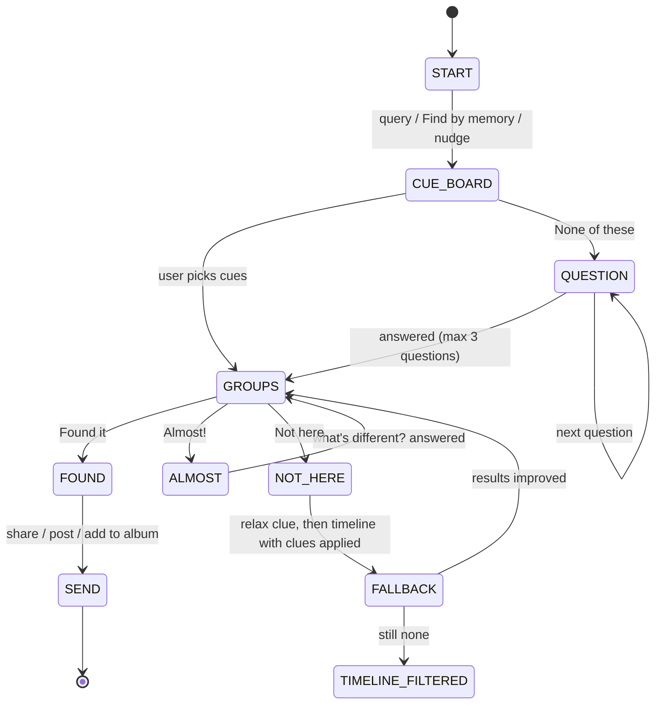

# Implementation Plan: Memory Board (Photo Retrieval Prototype)

| | |
|---|---|
| **Version** | 1.0, October 2026 |
| **Status** | Ready for build |
| **Target executor** | An AI coding agent (Google Antigravity or similar), supervised by a human PM |
| **Product goal** | Raise **VRSR** (Vague Retrieval Success Rate): the share of users who find a photo they remember but cannot precisely describe |
| **One-line idea** | Don't make people *describe* a photo. Help them *recognise* it. |

---

## 0. How the agent should use this file

1. Read the whole file before writing code.
2. Work **one phase at a time** (Section 11). Do not start phase N+1 until phase N's acceptance criteria pass.
3. After each phase, produce a short walkthrough: what changed, test results, and screenshots of every new screen at **390×844** (mobile) if you have a browser tool.
4. Every numeric constant in this plan lives in `config` (Appendix D). Never hard-code them in components or algorithms.
5. If a requirement is ambiguous or impossible, **stop and ask**. Do not silently substitute.
6. Never upload user photos anywhere. All processing is local (Section 13).
7. Keep the scope honest: this is a **standalone prototype** that simulates Photos search. It is not an integration into Google Photos (Section 3).

---

## 1. Context

### 1.1 The problem
People remember a photo as a **story** (who, where, the light, what was happening) but not the date or the right keywords. They recognise the right photo the moment they see it (5 of 5 interviewees), but Photos asks them to **recall words**. When the first search misses:
- results are broad and each new search forgets the last (Continuing barrier),
- the story won't fit a search box (Starting barrier),
- so users scroll, retype, switch to WhatsApp or give up.

### 1.2 The solution
**Memory Board** replaces "type the perfect query" with a short guided loop:
1. Show 4-5 **cue cards** (colours, tag, 3 thumbnails): *"Does any of these ring a bell?"*
2. **Yes** → show up to 3 **groups of 10-15 similar photos** with an honest **confidence band**.
3. **No / not sure** → **Guided Recall**: ask about things the user may not have thought of, each with **4 options + "Can't recall"**.
4. The search **never dead-ends**, it keeps every clue.
5. A gentle **scroll nudge** offers the flow when someone is hunting in the timeline.

### 1.3 Why this differs from today's Ask Photos
Ask Photos supports conversational follow-ups, which still require the user to put the memory into words. Memory Board is built on **recognition**: tiles, 4-option questions, confidence with reasons, and a nudge at the moment of failure. *Verify in the live app that no equivalent exists before claiming this externally.*

---

## 2. Goals, non-goals, success metrics

### 2.1 Goals (prototype)
- G1. A user can find a target photo through Memory Board in a median of **≤ 45 s** (hard ceiling in testing: **120 s**).
- G2. Every step responds in **≤ 1 s** (server compute ≤ 300 ms p95 at 2,000 photos).
- G3. The confidence score is **computed from user input**, never random, and is **calibrated** (Section 6.6).
- G4. The flow **never dead-ends**.
- G5. The prototype can be compared against baselines in an automated **simulation harness** (Section 10).

### 2.2 Non-goals (this build)
- Integration with real Google Photos data, accounts or servers.
- Persistent "Park it" threads, Friend Rescue, "postable" predictions, Calendar/Maps context (see Section 16).
- Voice input, sketch input, gamification.
- Production-grade multi-user scale.

### 2.3 Success metrics

| Metric | Definition | Target |
|---|---|---|
| **Found-in-3** | % of sessions where the user taps Found within 3 steps | ≥ 60% (simulated), ≥ 50% (usability test) |
| **Time-to-find** | Seconds from session start to Found | median ≤ 45, p90 ≤ 120 |
| **None-of-these rate** | % of Cue Boards where the user taps None of these | ≤ 50% (higher means weak cues) |
| **Can't-recall rate** | Per question | Report only; use to retire weak questions |
| **Calibration error (ECE)** | Gap between predicted band and real hit rate | ≤ 0.10 |
| **Nudge acceptance** | % of nudges tapped "Find by memory" | Report; guardrail: dismissals must not trigger permanent suppression on first dismissal |
| **Baseline win** | Memory Board vs (a) timeline scroll, (b) one-shot text query | Beat both on steps-to-find in simulation |

---

## 3. Scope: what is real vs simulated

| Area | Prototype treatment |
|---|---|
| Photo library | **Real**: user supplies 500-5,000 photos in a local folder (consented, or a public set such as an open-licensed dataset) |
| Visual understanding | **Real**: CLIP embeddings, zero-shot cue tags, colour palettes |
| Groups, confidence, questions | **Real**: implemented per Section 6 |
| Behaviour data (opens, shares) | **Real in-app** (counted from prototype use) + **seedable** for demos |
| Source (took / sent / screenshot) | **Inferred** from filename patterns and EXIF |
| Trash, Archive, Locked, "not backed up" | **Simulated flags** on photo records (phase 7) |
| Google account, sync, sharing | **Out of scope** |

> Dependencies that a real Photos build would need (engineering to confirm): access to existing visual embeddings, source/sender metadata, backup status, face-group data. See Section 15.

---

## 4. Architecture and stack

### 4.1 Stack (default; change only with a reason)

| Layer | Choice |
|---|---|
| Frontend | Next.js 14 (App Router) + TypeScript + Tailwind, mobile-first (design width 390px) |
| Backend | Python 3.11 + FastAPI |
| ML | `open_clip_torch` (ViT-B-32, CPU is fine), `numpy`, `scikit-learn`, `opencv-python-headless`, `Pillow`, MediaPipe Face Detection (store **face count only**) |
| Storage | SQLite (SQLModel) + `embeddings.npy` + thumbnails on disk |
| Tests | `pytest`, `vitest`, Playwright (UI smoke) |
| Tooling | `make setup`, `make ingest`, `make dev`, `make eval`, `make test` |

### 4.2 Repo layout

```
memory-board/
├─ implementation_plan.md
├─ Makefile
├─ config/config.yaml              # all constants (Appendix D)
├─ data/
│  ├─ photos/                      # user-supplied images (gitignored)
│  ├─ thumbs/                      # 256px + 1024px WebP
│  ├─ embeddings.npy
│  └─ app.db
├─ api/
│  ├─ app/main.py                  # FastAPI entry
│  ├─ app/ingest/                  # EXIF, palette, tags, faces, sharpness
│  ├─ app/engine/                  # cue_board.py, groups.py, confidence.py,
│  │                               # questions.py, almost.py, fallback.py, session.py
│  ├─ app/vocab.py                 # cue vocabulary (Appendix A)
│  ├─ app/models.py                # SQLModel tables
│  └─ tests/
├─ web/
│  ├─ app/                         # routes: /, /search/[sessionId]
│  ├─ components/                  # Timeline, CueBoard, GroupCard, QuestionSheet, ...
│  ├─ lib/                         # api client, telemetry, nudge hook, i18n
│  └─ locales/{en,hi-Latn}.json
└─ eval/
   ├─ simulate.py                  # simulated-user harness (Section 10)
   └─ reports/
```

### 4.3 Flow



---

## 5. Data model

```sql
CREATE TABLE photos (
  id TEXT PRIMARY KEY,
  path TEXT NOT NULL,
  taken_at TEXT,                 -- EXIF DateTimeOriginal, nullable
  hour_bucket INTEGER,           -- 0-23, from EXIF or brightness fallback
  width INTEGER, height INTEGER,
  source TEXT CHECK(source IN ('camera','screenshot','received','saved','unknown')),
  face_count INTEGER DEFAULT 0,
  sharpness REAL,                -- Laplacian variance
  brightness REAL,               -- 0-1
  palette TEXT,                  -- JSON: 3 hex colours
  embedding_idx INTEGER,         -- row in embeddings.npy
  -- simulated flags (phase 7)
  in_trash INTEGER DEFAULT 0, archived INTEGER DEFAULT 0,
  locked INTEGER DEFAULT 0, backed_up INTEGER DEFAULT 1
);

CREATE TABLE photo_tags (        -- zero-shot cue scores
  photo_id TEXT, cue_id TEXT, score REAL,
  PRIMARY KEY (photo_id, cue_id)
);

CREATE TABLE photo_activity (    -- behaviour signals
  photo_id TEXT PRIMARY KEY,
  opens INTEGER DEFAULT 0, shares INTEGER DEFAULT 0, favorite INTEGER DEFAULT 0,
  last_opened_at TEXT
);

CREATE TABLE sessions (
  id TEXT PRIMARY KEY, started_at TEXT, ended_at TEXT,
  entry TEXT,                    -- 'query' | 'button' | 'nudge'
  initial_query TEXT, outcome TEXT, found_photo_id TEXT
);

CREATE TABLE events (            -- telemetry (Section 9)
  id INTEGER PRIMARY KEY AUTOINCREMENT, session_id TEXT,
  name TEXT, ts TEXT, payload TEXT
);
```

```ts
// web/lib/types.ts
type Polarity = "positive" | "negative";
interface Clue {
  id: string;
  kind: "cue" | "answer" | "almost" | "source" | "sentence";
  key: string;                 // e.g. "lighting.warm_yellow"
  polarity: Polarity;
  weight: number;              // from config.clue_weights[kind]
  label: string;               // user-visible chip text
}
type Band = "highest" | "good" | "possible" | "unsure";
interface Group {
  id: string; label: string; photoIds: string[];   // 10-15
  confidence: number; band: Band;
  why: string[];                                   // ["yellow light", "3 people"]
  confidenceDelta?: number;                        // change since last step
  tags?: ("often_opened"|"often_shared"|"not_opened_1y")[];
}
```

---

## 6. Core logic

### 6.1 Ingestion pipeline (`make ingest`)
For each image in `data/photos/` (idempotent, re-run safe):
1. Read EXIF (`DateTimeOriginal`, `Make`, `Model`). Compute `hour_bucket` (fallback: brightness → day/night guess).
2. Create thumbnails 256px and 1024px (WebP).
3. Compute CLIP image embedding (L2-normalised), append to `embeddings.npy`.
4. Compute `brightness`, `sharpness` (Laplacian variance), and a **3-colour palette** (k-means on a 64×64 downsample).
5. Count faces (MediaPipe). **Store the count only**; do not store face crops or embeddings.
6. Compute zero-shot cue scores (Section 6.2) and write `photo_tags`.
7. Infer `source` (Section 6.9).
8. Print a report: photos processed, time per photo, failures.

**Acceptance:** 2,000 photos ingest in ≤ 15 min on CPU; re-run adds only new files; no network calls.

### 6.2 Cue vocabulary and tagging
- Vocabulary is defined in `vocab.py` (Appendix A): ~40 cues in 5 groups (lighting, setting, scene, people, colour mood).
- Each cue has 2-3 text prompts (e.g. "a photo taken at night", "a photo lit by warm yellow lights").
- Score = softmax over the prompts of one group against the image embedding; a cue is **active** for a photo if `score ≥ τ_cue` (config).
- People group uses `face_count` (rules), not CLIP.
- Cache all scores in `photo_tags`.

### 6.3 Clue state
A session holds a list of `Clue` objects.
- **Positive**: the user confirmed it (picked a card, answered a question, filled a sentence blank).
- **Negative**: the user rejected it ("Not here" demotes a group's dominant cues; "Almost" marks differences).
- **"Can't recall" adds nothing**: no clue, no penalty. (Core rule.)
- Every clue is shown as a **removable chip** in the clue trail. Removing one re-runs scoring. **Rewind** pops the last action.

### 6.4 Cue Board generation
Input: optional initial query `q`, current clues.

1. **Candidate set C**:
   - if `q`: top `N_query` photos by CLIP text-image similarity, plus keyword matches in cue labels;
   - else: the whole library (or a stratified sample if > 5,000).
   - Apply positive clues as a **soft filter** (never an empty result; use scores).
2. For each cue `c`, support set `S_c = {i ∈ C : tag(i,c) ≥ τ}`. Keep cues with `min_support ≤ |S_c|/|C| ≤ max_support` (config, default 5%-60%), which removes trivial and rare cues.
3. Choose **4-5 cards** by greedy MMR: maximise coverage gain minus `λ × Jaccard overlap` with already-chosen cards. Constraint: at least **2 different vocabulary groups** represented.
4. **Card content**:
   - label (cue text, localised);
   - 3 swatches: the dominant colours of `S_c` (k-means on member palettes);
   - 3 thumbnails: medoid + 2 most-different members of `S_c` (diversity first, so tiles don't look alike).
5. Always render **"None of these"** and **"Not sure"** controls.
6. If the library has fewer than `min_library_for_board` photos (default 2,000), skip to direct results.

**Acceptance:** board renders ≤ 1 s p95; ≥ 4 cards; no two cards share > `max_card_overlap`; thumbnails within a card are visibly different (mean pairwise embedding distance above threshold).

### 6.5 Group builder
1. Score every photo in `C`: `s_i = Σ_clues polarity × weight × tag(i,clue)` (+ small query similarity term).
2. Take the top `M = 60` by `s_i`.
3. Cluster those 60 in embedding space (k-means, `k = 3..5`, pick k by silhouette).
4. **Enforce group size 10-15**: split clusters > 15 with a sub-k-means; trim to the top 15 by score; merge/discard clusters < 10 into the nearest group.
5. Show **up to 3 groups**, sorted by group confidence.
6. Label each group from its top 2 shared active cues; show the group palette.

### 6.6 Confidence score (calculated from user input, never random)

Let `P` = confirmed positive clues, `N` = rejected clues, `G` = a group.

```
match(G)     = Σ_{c∈P} w_c · frac(G,c) / Σ_{c∈P} w_c        # frac = share of G's photos with cue c active
exclusion(G) = Σ_{n∈N} w_n · frac(G,n) / Σ_{n∈N} w_n        # 0 if N is empty
tight(G)     = clamp((mean pairwise cosine sim in G − 0.5) / 0.4, 0, 1)
prior(G)     = mean behaviour prior of photos in G           # 0-1, Section 6.14
evidence     = min(1, |P| / evidence_clues_for_full)         # default 3

raw  = 0.55·match − 0.20·exclusion + 0.15·tight + 0.10·prior   # clamp 0-1
conf = raw × (0.6 + 0.4·evidence)                              # more user input → higher ceiling
```

- If `|P| = 0` (the user said None/Can't recall to everything): `match = 0`, band is forced to **"unsure"** and the UI says *"Not sure yet. One more question?"*
- **Calibration:** run the simulation (Section 10), then fit an **isotonic regression** from `conf` to the true hit rate (target photo inside the group). Save the mapping in `config`. Bands are defined on calibrated probability.
- **Bands** (initial; tune after calibration):

| Band | Calibrated probability | UI label |
|---|---|---|
| highest | ≥ 0.60 and rank 1 | **Highest chance** |
| good | 0.35 to 0.60 | **Good chance** |
| possible | 0.15 to 0.35 | **Possible** |
| unsure | < 0.15 | *Not sure yet* (ask another question) |

- **Show bands, not percentages**, until ECE ≤ 0.10.
- **Always show the why** (`["yellow light","3 people"]`) and the **movement** ("Confidence rose after your last answer") from `confidenceDelta`.
- If two groups tie within 0.05, label both "Good chance" (never fake a winner).

### 6.7 Guided Recall: question selection
Question bank: Appendix B. Each question has **exactly 4 substantive options + "Can't recall"**.

1. For the remaining candidate set `R`, assign each photo to at most one option per question (by tag or attribute).
2. Compute the **information gain** of a question: entropy of the option distribution, `H = −Σ p_k log2 p_k` (max 2 bits for 4 options).
3. Eligibility: at least 2 options with `p_k ≥ 0.10`; not already asked; not implied by existing clues.
4. Ask the eligible question with the highest `H`. **Max `max_questions` (3).** If every `H < min_gain_bits` (0.5), stop asking and go to groups or fallback.
5. Answer → positive clue. "Can't recall" → no clue, move on.
6. UI: bottom sheet, 4 large option tiles, "Can't recall" as a visible equal-weight button.

### 6.8 "Almost!"
Trigger: the user taps **Almost** on a photo in a group.
1. Take the photo `p`; find `k = 30` nearest neighbours in embedding space; prefer those within ±3 h of `p` (same moment).
2. Compare `p`'s cue tags against the neighbours' dominant tags; find the dimension with the most variation.
3. Ask **"What's different?"** with 4 options: *Different place · Different time of day · Different people · Different look (clothes/colours)* + "Can't say".
4. The answer adds a positive clue (direction) and re-runs groups, seeded from the neighbours of `p`.

### 6.9 Source card
- Inference rules (`ingest/source.py`):
  - filename `IMG-########-WA####` or a path containing `WhatsApp` → `received`
  - filename `Screenshot_*` or no camera `Make/Model` + screen-size dimensions → `screenshot`
  - camera EXIF `Make/Model` present → `camera`
  - path containing `Download`/`Saved` → `saved`; otherwise `unknown`
- Question: **"How did it reach you?"** (*I took it · Someone sent it · Screenshot · Saved from somewhere* + Can't recall). Answer becomes a positive clue on `source`.

### 6.10 Fill-the-sentence
One line with tappable blanks, each blank opens a 4-option sheet:
> It was **[morning / afternoon / evening / night]**, **[indoors / outdoors]**, with **[just me / 2 / 3-5 / crowd]**, near **[food / stage / water / greenery]**.

- Skipped blanks add nothing. Filled blanks become positive clues (kind `sentence`).
- Entry point: a "Fill it in" tab on the Cue Board.

### 6.11 Found → Send
- On **Found it**: stop the flow immediately (no further questions).
- Open the group's **best shot**: `best = argmax(0.6·norm(sharpness) + 0.4·exposure_score)` (exposure score = 1 − |brightness − 0.5| × 2).
- Show the best shot first, with the other group photos as a strip.
- Actions: **Share** (Web Share API), **Post**, **Add to album** (local album stub). Record `share` in `photo_activity`.

### 6.12 No-dead-end fallback ladder
When the user taps **Not here** (or all groups are `unsure`):
1. **Relax**: drop the least-certain positive clue (lowest weight × lowest match) and re-run groups. Say which clue was relaxed.
2. **Ask**: if bits remain, ask one more question (counts toward the max).
3. **Hiding places check** (phase 7): look in Trash, Archive, Locked, un-backed-up and shared buckets.
4. **Timeline with clues applied**: open the timeline filtered/ranked by the current clues, with the clue trail still visible and editable.
The user can **Rewind** at any point. Nothing is lost, ever.

### 6.13 Scroll nudge
Hook: `useScrollNudge()` on the timeline.
- **Continuous scrolling**: scroll events with gaps < `scroll_gap_ms` (800 ms) accumulate time.
- **Trigger**: ≥ `nudge_seconds` (10 s) continuous **and** at least one hunting signal: ≥ 3 direction reversals, or scrolled past ≥ 3 months of photos, or ≥ 40 rows.
- **Message**: *"Looking for a photo? Find it by what you remember."* Buttons: **Find by memory** · **Not now**.
- **Rules**:
  - max **1 nudge per session**; never while the photo viewer is open; never within 60 s after a Found;
  - **Not now** → off for the session; **3 dismissals in 14 days** → off for 30 days (counters in `localStorage`, wrapped in try/catch);
  - respect a Settings toggle "Search nudges".
- Log: `nudge_shown`, `nudge_accepted`, `nudge_dismissed`, `nudge_suppressed`.

### 6.14 Behaviour tags and prior
- Record `opens`, `shares`, `favorite`, `last_opened_at` per photo.
- Tags: **Often opened** (top 20% by opens), **Often shared** (top 20% by shares), **Not opened in a year** (`last_opened_at` older than 365 days or never).
- `prior_i = 0.5·norm(opens) + 0.3·norm(shares) + 0.2·favorite` (0-1).
- **MVP use**: only (a) a tie-breaker in ranking (weight ≤ 0.10 in confidence) and (b) a small label on a group ("You shared this before").
- **Never filter by these tags.** Rarely opened photos are often exactly the ones people can't find.

### 6.15 v1.1 features (phase 7)
- **Landmark before/after**: segment the timeline into "moments" (gap > 6 h, or location/people change); auto-name by top cue; add a festival list (config). Ask **"Closer to A or B?"** with 4 landmarks; each pick narrows the date range (binary-search style).
- **Hiding places check**: query the simulated flags (`in_trash`, `archived`, `locked`, `backed_up = 0`) and show a clear message per bucket.
- **Who-was-there row**: using face **counts** and co-occurrence in the *candidate set only* (no biometrics). Real face groups come from the real product (Section 15).
- **Clue trail + Rewind**: already in phase 2; polish here.
- **Match highlight**: draw a soft outline for the matched region using CLIP patch/attention maps if feasible; otherwise skip and show the "why" chips only.
- **Paint-it palette**: pick up to 3 colours + day/night; match against stored palettes (ΔE in Lab).
- **Language labels**: Hinglish (`hi-Latn`) locale for cue tags and questions.

---

## 7. API (FastAPI)

All responses JSON. Latency budget per call: **≤ 300 ms p95** server-side at 2,000 photos.

| Method + path | Purpose |
|---|---|
| `POST /api/ingest/run` | Trigger ingestion (dev only) |
| `GET  /api/photos?cursor=` | Timeline page (date-sorted) |
| `POST /api/session` | Start session `{entry, query?}` → `{sessionId, step: "cue_board", cards[]}` |
| `POST /api/session/{id}/cues` | Submit chosen cue ids → `{step: "groups", groups[], clues[]}` |
| `POST /api/session/{id}/none` | "None of these" → `{step: "question", question}` |
| `POST /api/session/{id}/answer` | `{questionId, optionId \| "cant_recall"}` → next step |
| `POST /api/session/{id}/sentence` | Fill-the-sentence blanks → groups |
| `POST /api/session/{id}/almost` | `{photoId}` → `{step: "question", question}` |
| `POST /api/session/{id}/not-here` | Fallback ladder → next step |
| `POST /api/session/{id}/rewind` | Undo last action |
| `POST /api/session/{id}/clues/remove` | Remove a chip |
| `POST /api/session/{id}/found` | `{photoId, groupId}` → best shot + share options |
| `POST /api/activity` | `{photoId, kind: open\|share\|favorite}` |
| `POST /api/events` | Telemetry batch (Section 9) |

Example response (`groups` step):
```json
{
  "step": "groups",
  "clues": [{"id":"c1","key":"lighting.warm_yellow","label":"Warm yellow light","polarity":"positive"}],
  "groups": [{
    "id": "g1", "label": "Warm light, 3 people",
    "photoIds": ["p101","p102"],
    "band": "highest", "confidenceDelta": 0.18,
    "why": ["yellow light","3 people"], "tags": ["often_shared"]
  }]
}
```

---

## 8. UI specification (mobile-first, 390 px)

| Screen | Contents | States to build |
|---|---|---|
| **Timeline** | Date-sorted grid, search bar with **Find by memory** pill, nudge bottom sheet | loading, empty library, nudge shown |
| **Cue Board** | Prompt *"Does any of these ring a bell?"*; 4-5 multi-select cards (3 swatches, tag, 3 thumbs); **None of these**; tab **Fill it in** | loading skeleton, error, ≤ 3 cards fallback |
| **Groups** | Up to 3 group cards: label, band badge, why chips, delta text, 10-15 thumbs; actions **Found it · Almost! · Not here** | loading, `unsure` state ("Not sure yet") |
| **Question sheet** | Question text, 4 large option tiles, **Can't recall** (equal prominence), progress "1 of 3" | loading, last question |
| **Almost!** | "What's different?" sheet (4 options + Can't say) | n/a |
| **Found / Send** | Best shot large, strip of group photos, Share / Post / Add to album | share unavailable fallback |
| **Fallback** | Plain-language message of what was relaxed; timeline with clue chips | n/a |
| **Clue trail bar** | Persistent chips (removable) + **Rewind** | empty |

**UX rules**
- Never more than **one decision per screen**.
- "Can't recall" is a **normal button**, not hidden or grey.
- Tap targets ≥ 48 px; support dynamic text size; contrast ≥ WCAG AA.
- Always show a skeleton ≤ 100 ms, results ≤ 1 s.
- Copy is short and plain; strings come from `locales/*.json`.

**Microcopy (EN / Hinglish; have a native speaker review the Hinglish)**

| Key | EN | hi-Latn |
|---|---|---|
| `board.prompt` | Does any of these ring a bell? | Inme se kuch yaad aa raha hai? |
| `board.none` | None of these | Inme se koi nahi |
| `question.cant` | Can't recall | Yaad nahi |
| `groups.highest` | Highest chance | Sabse zyada chance |
| `groups.unsure` | Not sure yet. One more question? | Abhi pakka nahi. Ek aur sawaal? |
| `nudge.title` | Looking for a photo? Find it by what you remember. | Photo dhoondh rahe ho? Jo yaad hai usse dhoondho. |
| `nudge.dismiss` | Not now | Abhi nahi |

---

## 9. Telemetry

Local only (SQLite `events`), batched from the client. Every event carries `session_id` and `ts`.

| Event | Payload |
|---|---|
| `session_start` | entry, initial_query, library_size |
| `board_shown` | cue_ids, render_ms |
| `board_selection` | selected_ids / `none` |
| `question_shown` / `question_answered` | question_id, option_id or `cant_recall`, bits |
| `groups_shown` | group_ids, bands, confidences, sizes |
| `almost_tapped` / `not_here_tapped` | photo_id / group_id |
| `fallback_step` | step name |
| `found` | photo_id, group_id, steps, seconds |
| `abandon` | last_step, seconds |
| `nudge_*` | shown / accepted / dismissed / suppressed |

A script `eval/metrics.py` computes the Section 2.3 metrics from `events`.

---

## 10. Evaluation harness (simulated users)

Purpose: measure value and calibrate confidence **before** any human test.

**Simulated user model** (`eval/simulate.py`)
1. Pick a random **target photo** `t`.
2. The user "knows" each attribute of `t` with probability `p_know` (config; defaults: scene 0.7, lighting 0.6, people 0.7, source 0.5, exact date 0.05).
3. Cue Board: pick a card that matches `t` with prob `p_pick = 0.85` if a known attribute matches, else None of these.
4. Questions: answer correctly if known; else **Can't recall**; wrong answer prob `p_wrong = 0.05`.
5. Found when `t` is inside a shown group and the user "recognises" it (prob `p_recognise = 0.95`).
6. Cap at 3 steps for Found-in-3; cap at 6 for the overall run.

**Baselines**
- **B1 timeline scroll**: expected number of thumbnails scrolled to reach `t` in date order.
- **B2 one-shot text query**: user types 1-2 words derived from known attributes; rank of `t` in CLIP text results.

**Outputs** (`eval/reports/`)
- Table: Found-in-3, mean steps, mean items scanned (Memory Board vs B1 vs B2), N = 2,000 simulated sessions.
- **Reliability diagram + ECE** for confidence; fitted isotonic mapping saved to `config`.
- Ablation: with vs without each add-on (Almost!, Source, Sentence, behaviour prior).

**Gate:** Phase 8 may not start until Memory Board beats B1 and B2 on mean items scanned **and** ECE ≤ 0.10 in simulation. If not, return to Phases 2-5.

> Simulated results are a **sanity check**, not evidence of real user behaviour. Real validation is the usability test (Section 11, Phase 9).

---

## 11. Phases and tasks

Sizing: **S** ≈ under a day · **M** ≈ 1-3 days · **L** ≈ 3-5 days (agent time, including tests).

### Phase 0: Setup (S)
- [ ] Monorepo scaffold, `Makefile`, `config/config.yaml`, lint and format, CI-less local test runner.
- [ ] Load config in API and web; a failing test if any constant is hard-coded.
- **Done when:** `make setup && make test` is green on a clean checkout.

### Phase 1: Ingestion and understanding (L)
- [ ] EXIF, thumbnails, brightness, sharpness, palette, face count, source inference (6.1, 6.9).
- [ ] CLIP embeddings + `embeddings.npy`; zero-shot cue tags (6.2).
- [ ] `make ingest` report; idempotent re-runs.
- **Done when:** 2,000 photos ingest ≤ 15 min; unit tests cover EXIF fallback, palette, source rules; cue tags spot-checked on 50 photos (≥ 80% sensible by human review).

### Phase 2: Cue Board (M)
- [ ] `engine/cue_board.py` (6.4) + `POST /api/session` + `POST /api/session/{id}/cues`.
- [ ] `CueBoard` component with swatches, tags, 3 thumbs, multi-select, None of these.
- [ ] Clue trail bar with removable chips and **Rewind** (6.3).
- **Done when:** board ≤ 1 s p95; ≥ 4 cards; diversity test passes (no near-duplicate cards or tiles).

### Phase 3: Groups and confidence (L)
- [ ] `engine/groups.py` (6.5): 10-15 per group, up to 3 groups.
- [ ] `engine/confidence.py` (6.6): formula, bands, why chips, delta.
- [ ] `GroupCard` UI with band badge, why, delta text; **Found it** button.
- **Done when:** property tests: confidence is monotone in matched clues; "Can't recall" never changes confidence; zero confirmed clues forces `unsure`; group sizes always 10-15.

### Phase 4: Guided Recall and no-dead-end (L)
- [ ] `engine/questions.py` (6.7), question bank (Appendix B).
- [ ] `QuestionSheet` UI (4 options + Can't recall), max 3 questions.
- [ ] `engine/fallback.py` (6.12): relax → ask → timeline with clues.
- **Done when:** a scripted run from "None of these" always ends in a result view or a clues-applied timeline; no state throws or shows an empty screen.

### Phase 5: MVP add-ons (M)
- [ ] **Almost!** (6.8), **Source card** (6.9), **Fill-the-sentence** (6.10), **Found → Send** (6.11).
- **Done when:** each add-on has an API test and a Playwright smoke test; Found stops the flow in ≤ 1 tap.

### Phase 6: Scroll nudge and behaviour tags (M)
- [ ] `useScrollNudge` with all rules and counters (6.13).
- [ ] Activity tracking + tags + prior as tie-breaker only (6.14).
- **Done when:** unit tests for trigger, cooldown, 3-dismissals-in-14-days suppression; the prior never removes a photo from results.

### Phase 7: Next-wave features (L)
- [ ] Landmark before/after, Hiding places (simulated flags), Who-was-there row, Match highlight (if feasible), Paint-it, Hinglish locale (6.15).
- **Done when:** each feature flag-gated and off by default; no regression in Phases 2-6 tests.

### Phase 8: Telemetry and evaluation (M)
- [ ] Event pipeline (Section 9), `eval/metrics.py`.
- [ ] Simulation harness, baselines, calibration, report (Section 10).
- **Done when:** the gate in Section 10 passes; the calibration mapping is committed to `config`.

### Phase 9: Usability test and polish (M)
- [ ] Clickable build deployed locally for tests; 5-8 participants (start with the 5 interviewees and willing survey respondents).
- [ ] Task cards from real failed searches (college-fest night, friend's birthday, rooftop sunset, hotel trip). Each person does the task in **current Photos** and in **Memory Board** (order counterbalanced).
- [ ] Measure: time-to-find, success, steps, None-of-these, confidence trust ("did the confidence match what you saw?"), a 1-5 ease rating.
- [ ] Fix top 5 usability issues; re-run the metrics.
- **Done when:** a written findings doc with metrics vs targets (Section 2.3).

---

## 12. Testing

| Level | What |
|---|---|
| **Unit** | confidence formula, entropy/question choice, group sizing, source inference, nudge rules, palette, EXIF fallbacks |
| **Property** | confidence monotone in matched clues; "Can't recall" is a no-op; empty clue set → `unsure`; group size always 10-15; no empty result screens |
| **Integration** | full API flows: cues → groups → found; none → question → groups; not-here → fallback ladder; rewind |
| **UI smoke (Playwright)** | all 8 screens render at 390×844; keyboard and screen-reader labels on option tiles; tap targets ≥ 48 px |
| **Performance** | per-step server ≤ 300 ms p95 at 2,000 photos; board ≤ 1 s end-to-end |
| **Simulation** | Section 10 gate |

---

## 13. Privacy and safety
- **All processing is local.** No photo, embedding, tag or event leaves the machine. Add a test that fails if any outbound network call is made during ingest or search.
- Store **face counts only**. No face embeddings, crops, or identity labels.
- Sample or consented photos only. Provide `make wipe` to delete `data/`.
- **Confidence honesty:** bands until calibrated; never show a number that is not derived from the formula; never imply certainty (copy review).
- **Nudge respect:** a settings toggle; no repeated nudges; no dark patterns (Not now is always equal weight to Find by memory).
- Hinglish and regional strings are reviewed by a native speaker before any user test.

---

## 14. Risks and mitigations

| Risk | Impact | Mitigation |
|---|---|---|
| Cue cards look alike or are generic | Board is useless; high None-of-these | Diversity-first MMR, thumbnail diversity, monitor None-of-these, retire weak cues |
| Zero-shot tags are noisy | Wrong groups, wrong confidence | Spot-check vocabulary; drop cues below quality bar; calibrate confidence on real data |
| Confidence not trustworthy | One random-looking result ends trust | Bands, why chips, calibration gate, "Not sure yet" state |
| Question fatigue | Users quit | Max 3 questions, information-gain ordering, Can't recall equal prominence |
| Interview enthusiasm overstated demand (some interview questions were leading) | Prototype may underperform in real use | Phase 9 behavioural test against current Photos |
| Nudge feels pushy | Opt-outs | Single nudge, decay not permanent ban, settings toggle |
| 2-minute target missed | Core promise fails | Measure, not assume; track p90; trim steps |
| Assumptions about Photos internals wrong | Prototype can't map to production | Section 15 checklist before any roadmap claim |

---

## 15. Open questions (for engineering, before any production claim)
1. Can the feature reuse Photos' existing visual embeddings and cue tags at query time, with what latency?
2. What source or sender metadata exists for received media? (WhatsApp does not put the sender in the saved file, so the "sent by" clue is likely partial.)
3. How are Trash, Archive, Locked Folder, shared-album and un-backed-up items exposed to search?
4. Can face-group data be used for the Who-was-there row under current privacy policy?
5. Which Indian languages and Hinglish are already supported in Photos search UI?
6. How does this interact with the Ask Photos / classic-search toggle and the Ask tab?
7. Is a confidence band acceptable in Photos' UX and brand guidance?

---

## 16. Backlog (explicitly not in this build)
- **Park it**: saved search threads that re-check as new photos, shares or backups arrive.
- **"You might be looking for…" and "postable"** predictions.
- **Friend Rescue**: one-tap "Ask Rhea?" with consent and no library access.
- **Calendar, Maps and Gmail context** (Life-Anchor Search).
- Persistent personal "memory-to-visual" model trained on real taps.

---

## Appendix A: Cue vocabulary (initial; edit in `vocab.py`)

| Group | Cues |
|---|---|
| **Lighting** | warm yellow light · bright daylight · golden hour · night / dark · neon / colourful lights · flash photo |
| **Setting** | indoors · outdoors · vehicle · home · food place (cafe/restaurant) · event venue (college/hall) · street |
| **Scene** | food stall · stage · water / beach · greenery / park · rooftop · crowd · cake / celebration · buildings · mountains · temple / festival |
| **People** (rule-based from face count) | just me · 2 people · 3-5 people · big crowd |
| **Colour mood** | warm (yellow/orange) · cool (blue/green) · dark · bright / white · red-heavy |

## Appendix B: Question bank (each = 4 options + Can't recall)

| Id | Question | Options |
|---|---|---|
| `q_time` | What time of day was it? | Morning · Afternoon · Evening · Night |
| `q_place` | Where was it? | Home · Food place · Outdoors · Event venue |
| `q_people` | How many people were in it? | Just me · 2 · 3 to 5 · Big crowd |
| `q_background` | What was in the background? | Water or sky · Buildings or street · Greenery · A room or walls |
| `q_colour` | What colour stood out? | Warm yellow/orange · Cool blue/green · Dark · Bright white |
| `q_source` | How did it reach you? | I took it · Someone sent it · Screenshot · Saved from somewhere |
| `q_occasion` | What was the occasion? | Trip · Celebration · College or work · Everyday |

## Appendix C: Almost! options
*Different place · Different time of day · Different people · Different look (clothes or colours)* + Can't say

## Appendix D: Config constants (`config/config.yaml`)

```yaml
board:
  cards_min: 4
  cards_max: 5
  min_support: 0.05
  max_support: 0.60
  mmr_lambda: 0.5
  max_card_overlap: 0.5
  min_library_for_board: 2000
groups:
  candidate_pool: 60
  group_min: 10
  group_max: 15
  groups_shown: 3
confidence:
  w_match: 0.55
  w_exclusion: 0.20
  w_tight: 0.15
  w_prior: 0.10
  evidence_clues_for_full: 3
  bands: {highest: 0.60, good: 0.35, possible: 0.15}   # on calibrated probability
  tie_margin: 0.05
  show_percentages: false                               # flip only when ECE <= 0.10
clue_weights: {cue: 1.0, answer: 1.0, source: 0.8, sentence: 0.8, almost: 0.7}
questions:
  max_questions: 3
  min_gain_bits: 0.5
  min_option_share: 0.10
nudge:
  seconds: 10
  scroll_gap_ms: 800
  reversals: 3
  months_scrolled: 3
  rows_scrolled: 40
  per_session_max: 1
  dismiss_window_days: 14
  dismiss_limit: 3
  suppress_days: 30
  quiet_after_found_s: 60
behaviour:
  top_share: 0.20
  not_opened_days: 365
  prior_weights: {opens: 0.5, shares: 0.3, favorite: 0.2}
performance:
  step_server_ms_p95: 300
  step_total_ms: 1000
sim:
  p_know: {scene: 0.7, lighting: 0.6, people: 0.7, source: 0.5, exact_date: 0.05}
  p_pick: 0.85
  p_wrong: 0.05
  p_recognise: 0.95
  sessions: 2000
```

## Appendix E: Definition of done (whole project)
- [ ] All phase acceptance criteria met; `make test` and `make eval` green.
- [ ] Simulation gate passed; calibration committed.
- [ ] Usability findings doc written (Phase 9) with metrics vs targets.
- [ ] No network calls during ingest or search (test in CI).
- [ ] README with setup, commands, screenshots, and the known-limits list from Sections 3 and 14.
